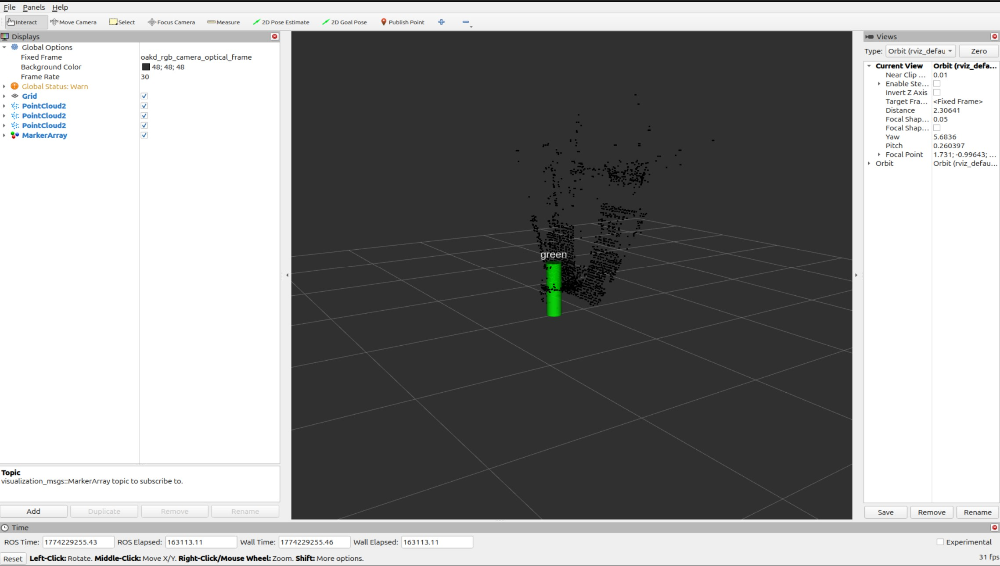
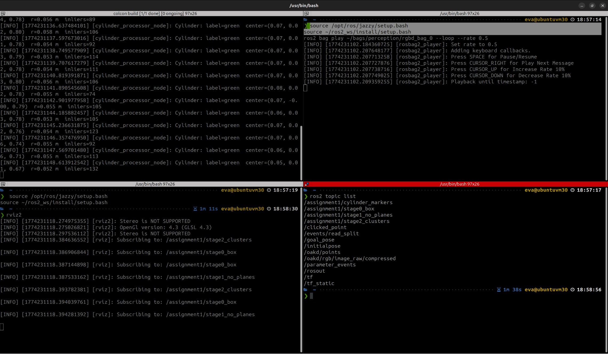
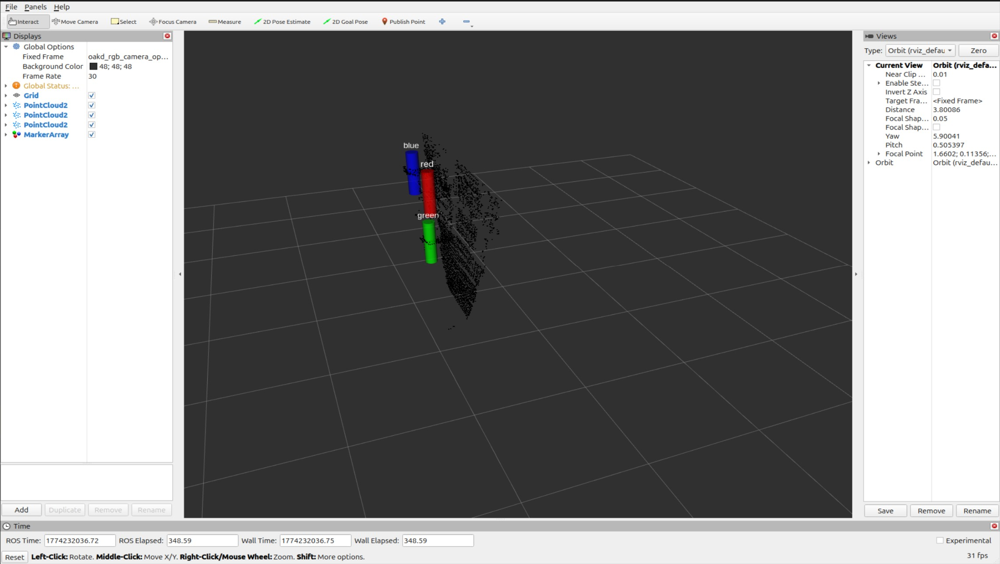
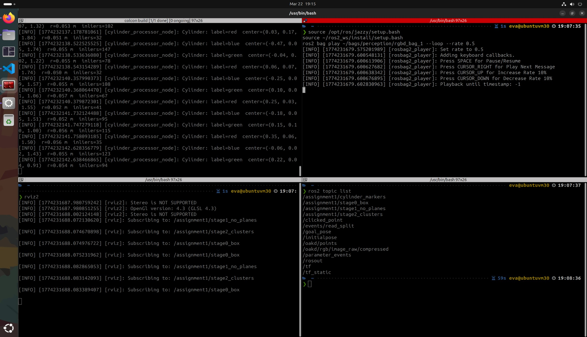
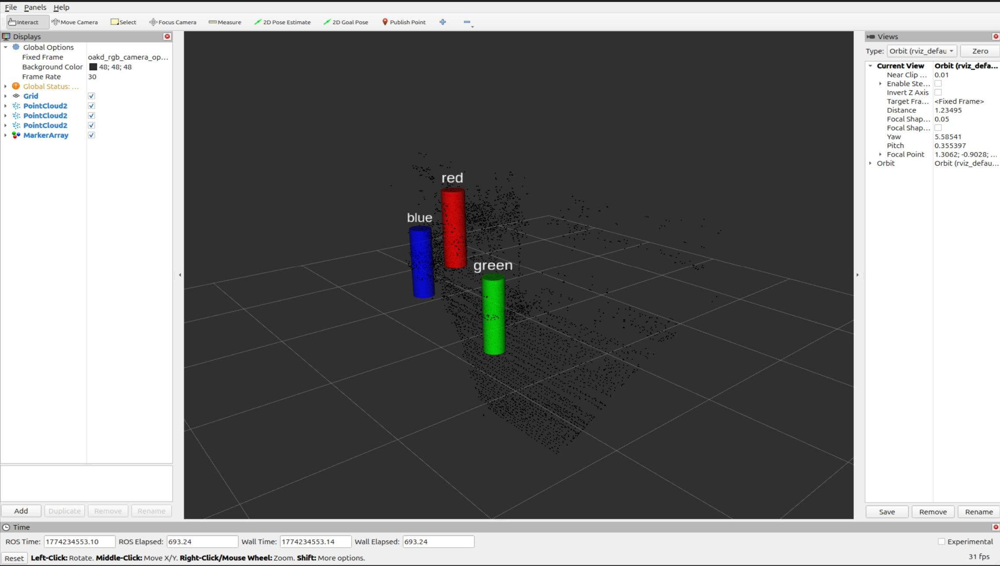
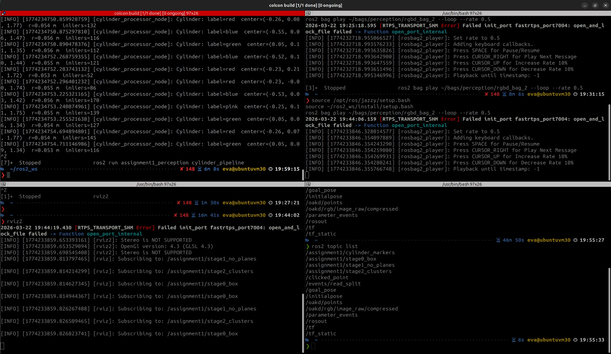
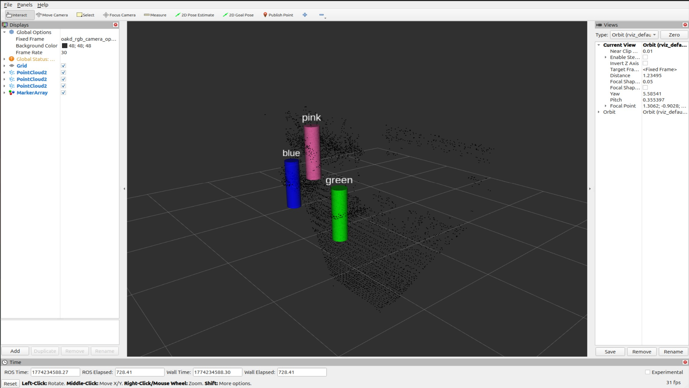

# Assignment 1 — Perception

**Course:** RAS 598 Mobile Robotics  
**Student:** Atharv Kulkarni  
**Environment:** Ubuntu with ROS 2 Jazzy  
**Package:** `assignment1_perception`

## Overview

This assignment implements a complete perception pipeline for semantic landmark extraction from RGB-D point cloud data. The input is a `PointCloud2` stream from `/oakd/points`. The goal is to detect cylindrical landmarks in the scene, estimate their geometric location, and classify their color.

The final pipeline detects cylinders reliably across the provided bags and publishes both intermediate point cloud stages and final labeled cylinder markers for RViz visualization. The implementation uses NumPy-based geometry, ROS 2 message handling, and `cKDTree` for nearest-neighbor and clustering operations.

---

## Dependencies Used

The implementation uses the following main dependencies:

- **ROS 2 Jazzy**
- **rclpy**
- **sensor_msgs**
- **visualization_msgs**
- **NumPy**
- **SciPy (`scipy.spatial.cKDTree`)**

No high-level point cloud libraries such as Open3D or PCL were used.

---

## Topics Used

### Input Topic
- `/oakd/points`  
  Input RGB-D point cloud used for all processing.

### Output Topics
- `/assignment1/stage0_box`  
  Point cloud after box filtering and voxel downsampling.

- `/assignment1/stage1_no_planes`  
  Point cloud after iterative plane removal.

- `/assignment1/stage2_clusters`  
  Clustered point cloud after Euclidean clustering.

- `/assignment1/cylinder_markers`  
  Final labeled cylinder markers published as `MarkerArray`.

### RViz Fixed Frame
- `oakd_rgb_camera_optical_frame`

---

## Configuration Parameters Used

The following configuration parameters were used in the final code:

### Box Filter
- `box_min = [-1.0, -0.6, 0.2]`
- `box_max = [1.0, 0.6, 2.0]`

These limits restrict the incoming cloud to the working region in front of the camera and remove points that are outside the useful detection space.

### Voxel Downsampling
- `voxel_size = 0.02`

A 2 cm voxel grid is used to reduce point count while preserving the overall scene geometry.

### Normal Estimation
- `normal_k = 15`

Each point normal is estimated using SVD on its 15 nearest neighbors.

### Plane Removal
- `plane_dist_thresh = 0.02`
- `expected_vertical = [0.0, 1.0, 0.0]`
- `plane_alignment_thresh = 0.85`
- `max_planes_to_remove = 3`
- `plane_ransac_iters = 100`

These parameters allow the pipeline to remove dominant horizontal planes such as floor or support surfaces while preserving object clusters.

### Euclidean Clustering
- `cluster_radius = 0.06`
- `cluster_min_size = 70`
- `cluster_max_size = 5000`

These values group nearby non-plane points into clusters and suppress very small noisy groups.

### Cylinder Detection
- `expected_cylinder_radius = 0.055`
- `cylinder_radius_tol = 0.015`
- `cylinder_axis_alignment_thresh = 0.80`
- `cylinder_min_inliers = 30`
- `cylinder_ransac_iters = 300`
- `max_cylinders = 3`

These settings constrain detection to near-vertical cylinders with radius close to the expected landmark radius.

---

## Algorithm

### 1. Box Filtering
The raw point cloud contains many points that are not relevant to the target landmarks. A 3D bounding box is applied first to keep only the points inside the valid region of interest. This removes far-away clutter and unnecessary scene points.

### 2. Voxel Downsampling
After spatial filtering, the cloud is downsampled using a voxel grid. Each voxel keeps one representative point. This reduces computational cost and makes later processing more stable without changing the overall scene structure significantly.

### 3. Surface Normal Estimation
For every remaining point, the local neighborhood is found using `cKDTree`. Singular Value Decomposition (SVD) is then applied to the neighborhood to estimate the local surface normal. The direction of minimum variance is used as the normal vector.

### 4. Iterative Plane Removal
The scene often contains large horizontal planes such as the floor or a tabletop. RANSAC is used to detect these dominant planes by repeatedly sampling 3 points, fitting a plane, and counting inliers. Only planes aligned with the expected vertical reference are accepted. This plane-removal step is repeated up to three times.

### 5. Euclidean Clustering
Once the planes are removed, the remaining points are grouped into clusters based on spatial proximity. Breadth-first search is used together with a radius-based neighbor query from `cKDTree`. Very small clusters are discarded as noise.

### 6. Cylinder Detection
Each valid cluster is tested with a cylinder RANSAC routine. Two points and their normals are sampled. The axis of the candidate cylinder is obtained from the cross product of the sampled normals. The model is accepted only if the axis is sufficiently aligned with the expected vertical direction. Inliers are then counted based on how closely their perpendicular distance to the axis matches the expected cylinder radius.

### 7. Color Classification
For each cylinder, the average RGB value of the cylinder inlier points is computed. This average RGB is converted to HSV and classified into a semantic label.

The final class ranges used were:
- **Red:** `hue < 20` or `hue >= 335`
- **Green:** `90 <= hue <= 150`
- **Blue:** `200 <= hue <= 260`
- **Pink:** `285 <= hue < 335` and `sat >= 0.12`

General thresholds:
- `val >= 0.15`
- `sat >= 0.08`

This color classification is applied only after a valid cylinder geometry has already been found.

### 8. Visualization
The pipeline publishes intermediate point cloud stages as well as final cylinder markers and text labels. This makes it possible to inspect each major stage of processing in RViz and verify that the detection result is geometrically and semantically correct.

---

## Results

## Bag 0

`rgbd_bag_0` contains a single green cylinder. The pipeline consistently detects one cylinder and classifies it as green. The marker remains stable over repeated frames, and the estimated radius stays close to the configured target radius of approximately **0.055 m**. This bag validates the core single-object pipeline: filtering, plane removal, clustering, cylinder fitting, and color labeling.

### Bag 0 RViz

### Bag 0 Terminal Output

---

## Bag 1

`rgbd_bag_1` contains multiple cylinders observed while the robot moves through the scene. In this case, the pipeline successfully tracks and classifies the visible landmarks as **red**, **blue**, and **green** across changing viewpoints.

The main challenge in this bag is viewpoint variation and motion. Even with movement, the detection remains stable because:
- plane removal isolates the object region,
- clustering separates object groups,
- cylinder geometry is constrained by radius and vertical alignment,
- classification is done using cylinder inlier points rather than raw scene points.

The results show that the system is not limited to a static single-object scene and can maintain consistent labeling under motion.

### Bag 1 RViz

### Bag 1 Terminal Output

---

## Bag 2

`rgbd_bag_2` contains multiple cylinders and was also used to evaluate the optional **pink** cylinder case. The pipeline consistently detects the three main cylinders as **red**, **blue**, and **green**. The pink cylinder is more difficult because its appearance is lighter and more sensitive to viewpoint, partial visibility, and color averaging over noisy points.

To improve this case, a dedicated pink threshold band was introduced in HSV space:

- **Pink:** `285 <= hue < 335` and `sat >= 0.12`

At the same time, the red range was adjusted to:
- **Red:** `hue < 20` or `hue >= 335`

This separation prevents the pink class from being swallowed by the red class. With this thresholding, pink appears in some frames while red, blue, and green remain consistently detected across the bag. This behavior is expected because the pink cluster can shift toward red or unknown depending on the visible surface points and the average color at that frame.

Overall, bag 2 demonstrates that the pipeline can detect all main cylinders reliably and can also identify pink in favorable views after explicit threshold tuning.

### Bag 2 RViz

### Bag 2 Terminal Output

### Bag 2 Pink Detection

---

## Summary

The final pipeline successfully performs:

- spatial filtering of raw RGB-D point cloud data,
- geometric simplification through downsampling,
- normal estimation,
- dominant plane removal,
- Euclidean clustering,
- cylinder model fitting,
- semantic color classification,
- RViz visualization of intermediate and final results.

Across the three bags:
- **Bag 0** validates reliable single-cylinder detection,
- **Bag 1** validates multi-cylinder detection under motion,
- **Bag 2** validates multi-cylinder detection with additional pink threshold tuning.

The final system is stable, interpretable, and aligned with the intended perception workflow for cylindrical landmark extraction.

---
